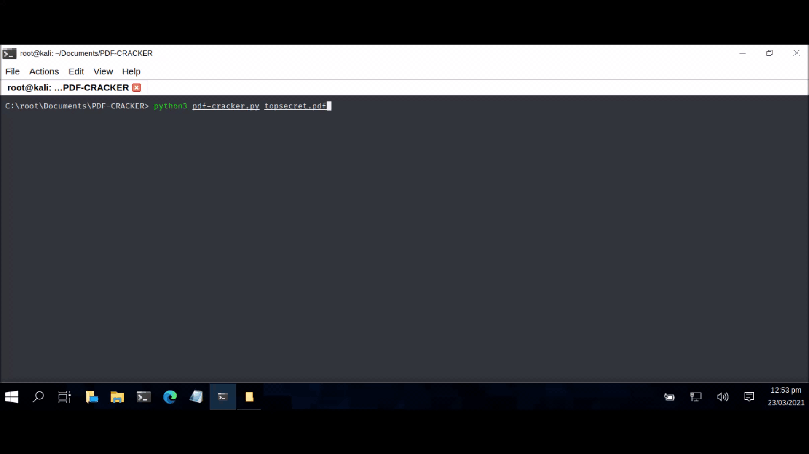

# PDF CRACKER
## A PYTHON SCRIPT FILE TO CRACK ENCRYPTED PDF FILES.

Usage: python3 pdf-cracker.py topsecret.pdf

| LANGUAGE | FILENAME       | MD5 HASH                         | 
|--------  |---------       |---------                         | 
| python3  | pdf-cracker.py | 9592f11c452f6cc31afbea2677b99a94 |
| pdf      | topsecret.pdf  | 28f04239dfa5422bc9b8e39f528faec8 | 

A python script file to crack encrypted .pdf files using bruteforce. The script is menu driven and allows the user to choose between a dictionary attack or a hash attack on the specified file. Once the password has been found, it then decrypts the file completely (Cracked.pdf).

### CONSOLE DISPLAY

### COMPUTER MISUSE ACT 1990 - SECTION 3A
This software program has been specifically written for the purpose of legitimate penetration testing and should not be used for any other unauthorised or nefarious reasons.

Found this project useful, or would like to buy the developer a coffee - make a donation.
https://paypal.me/TerenceBroadbent

