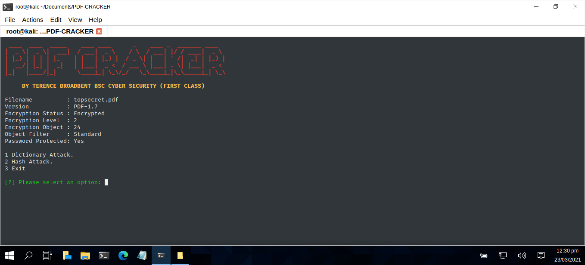

# PDF-CRACKER

python pdf-cracker.py topsecret.pdf

| LANGUAGE | FILENAME | COMMAND |
|--------  |--------- |---------|
| python | pdf-cracker.py | topsecret.pdf |
| |MD5 Hash - d279e8e8b939cf146638627892f4a055 |

Python script file to crack encrypted .pdf files using bruteforce. The script is menu driven and allows the user to choose between a dictionary attack or a hash attack on the specified .pdf file. Once the password has been found - it then decrypts the .pdf file completely (Cracked.pdf).

## CONSOLE DISPLAY

